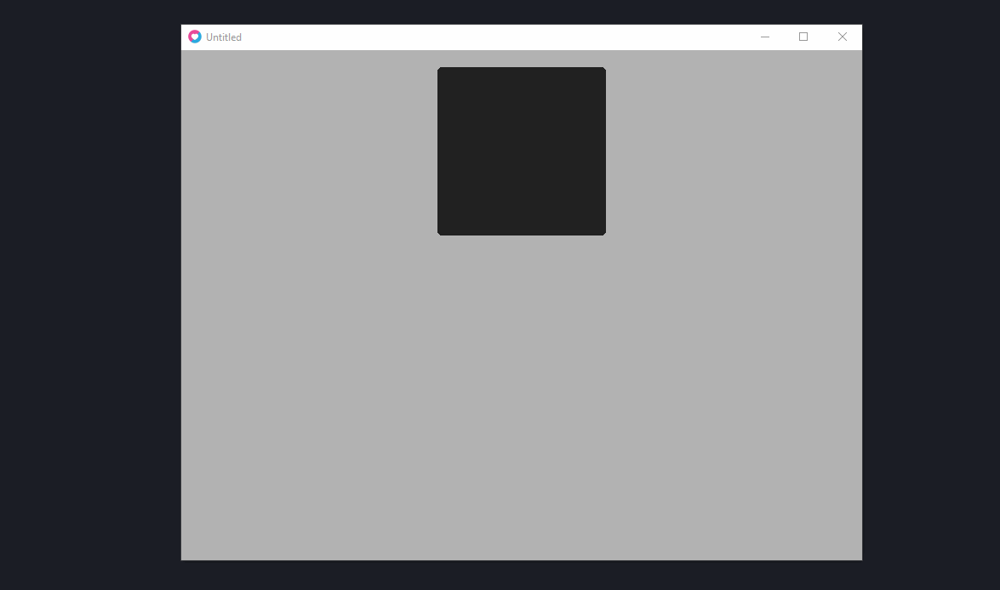

# Plan

`Plan` is a super simple layout helper designed for use with Love2d.

_Plan is in its very early stages, and is probably not ready for the big time.
Use with caution!_

## Usage

`Plan` is designed to sit all within a single file, and can easily be thrown
into your lib folder:

```lua
local Plan = require "path.to.libs.plan"
```

Before jumping into the code, it'd be good to go over the basic ideas of the
library, and how they fit together.

## Concept

At the core of `Plan` there are to objects, `Containers` - which are your
layout blocks, and `Rules` which determine where your Containers are positioned.

Containers are able to contain other Containers, and these children use their
own rules to determine their position _relative_ to its parent. By themselves,
Containers have no graphical component, hence the term "layout" helper, rather
than UI - there's still a bit of work ahead of you.

Let's look at an example.

## Example

Any layout managed by `Plan` requires a root. Calling `Plan.new()` will create a
new root which dimensions take up the entire screen at the point of calling.

We'll also hook into `update` and `draw` pre-emptively. For the root, and all
Containers really, these do nothing but call `update` and `draw` on its children

```lua
local Plan = require "lib.plan"

local uiRoot = nil

function love.load()
  uiRoot = Plan.new()
end

function love.update(dt)
  uiRoot:update(dt)
end

function love.draw()
  uiRoot:draw()
end
```

Lets add a new Container. I want this Container to be centered horizontally,
be 20 pixels from the top of the page, its height to be a third of the size
of the screen, and its width to be the same as its height - wow. Thats a
mouthful!

Thats where Rules come into play. The constructor for a `Container` requires a
`Rules` object to be passed in. These Rules are then used to compute the
position, and size, of the container.

`Plan` provides four rules out of the box:

* `PixelRule` for constant pixel values,
* `RelativeRule` for values relative to its parent,
* `CenterRule` for centering the position in its parent,
* `AspectRule` for maintaining an aspect ratio with itself

more advanced users can add their own if they see fit, but we'll leave that
for now.

Lets give the constraints listed out above a go in `Plan`:

```lua
local Plan = require "lib.plan"

local Container = Plan.Container
local Rules = Plan.Rules

local uiRoot = nil

function love.load()
  -- Plan exposes its internal rules via functions, rather than objects for
  -- ease of use.
  local layoutRules = Rules.new()
    :addX(Plan.center())
    :addY(Plan.pixel(20))
    :addWidth(Plan.aspect(1))
    :addHeight(Plan.relative(0.33))

  local container = Container:new(layoutRules)

  uiRoot = Plan.new()
  uiRoot:addChild(container)
end

function love.update(dt)
  uiRoot:update(dt)
end

function love.draw()
  uiRoot:draw()
end
```

Sweet! Lets run that and... nothing.

If you remember, `Containers` _have no graphical component_ - we have to add
that ourselves. Luckily, `Plan` makes it easy to do so - `Container:extend()`

Lets create a `Panel` object that acts like a container, but draws a standard
box:

```lua
local Panel = Container:extend()
```

`Container:extend()` returns an object that contains all the functions that
`Container` has, unless `Panel` chooses to override it - which we will. Because
we're adding a colour, and want to draw a coloured box, we'll need to override
the `new` function, and the `draw` function.

`Plan` makes this easy by exposing the `super` field on all extended objects.
If you're familiar with `classic.lua`, then this may look familiar

Lets take a look how this works

```lua
local Panel = Container:extend()

function Panel:new(rules, colour)
-- initialises all the container fields
  local panel = Panel.super.new(self, rules)
  -- then we can add our own to it
  panel.colour = colour
  panel.r = 5
  return panel
end

function Panel:draw()
  love.graphics.push("all")
  love.graphics.setColor(self.colour)
  love.graphics.rectangle("fill", self.x, self.y, self.w, self.h, self.r, self.r)
  love.graphics.pop()
  -- then we want to draw our children containers:
  Panel.super.draw(self)
end
```

And then, lets modify our `love` callbacks:

```lua
local Plan = require "lib.plan"
local Rules = Plan.Rules

local Panel = require "examples.panel"

local uiRoot = nil

function love.load()
  -- Plan exposes its internal rules via functions, rather than objects for
  -- ease of use.
  local layoutRules = Rules.new()
    :addX(Plan.center())
    :addY(Plan.pixel(20))
    :addWidth(Plan.aspect(1))
    :addHeight(Plan.relative(0.33))

  local panel = Panel:new(layoutRules, { 0.133, 0.133, 0.133 })

  uiRoot = Plan.new()
  uiRoot:addChild(panel)
end

function love.update(dt)
  uiRoot:update(dt)
end

function love.draw()
  uiRoot:draw()
end
```

Running this, it should look something like this:


Great Success!

Although, are you ready for the fun part? Lets say we want this layout to _keep_
its position, no matter on the screen size - `Plan` can help with that!

`Plan` exposes a function called `refresh` which will trigger every child
component to recalculate its position based off of its rules. Lets tie this into
`love.resize` so that our layout changes with the screen size.

First, we must create a `conf.lua` file that will enable the ability to resize
the window:

```lua
function love.conf(t)
  t.window.resizable = true
end
```

Then, we can add this to the bottom of our example:

```lua
function love.resize()
  uiRoot:refresh()
end
```

When we run this, we should see no difference to before, right? But now try
resizing the window:



Wahay! Our Panel now moves and scales depending on the Rules we set upon
creation.

## API

TODO